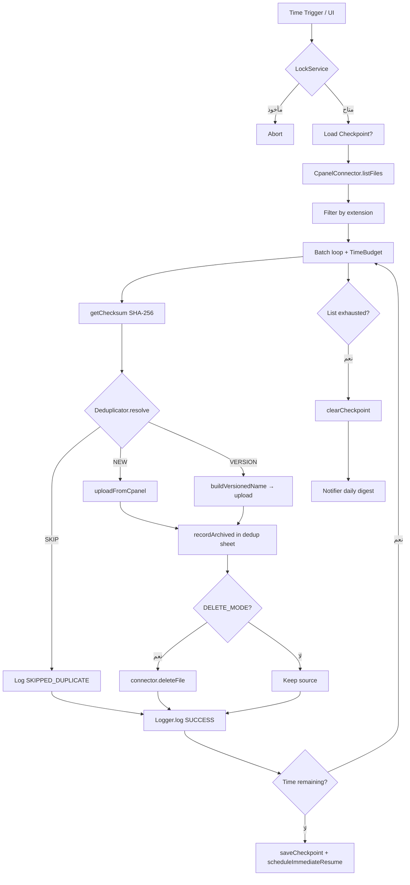

# cPanel Drive Archiver

نظام أرشفة احترافي يُبنى على **Google Apps Script** ينقل الملفات من خادم cPanel
إلى Google Drive مع الحفاظ التام على الهيكل الشجري، كشف التكرار عبر SHA-256،
إدارة الإصدارات، جدولة تلقائية، تقارير بريدية، وطابور يدوي لإعادة المحاولة.

> **English summary:** a Google Apps Script project that archives files from a
> cPanel server to Google Drive, preserving the directory tree, with SHA-256
> deduplication, versioning, scheduled runs, HTML email digests, checkpointing
> to survive the 6-minute execution limit, and a manual retry queue.

---

## 📋 المحتويات

- [المميزات](#-المميزات)
- [المعمارية](#-المعمارية)
- [المتطلبات](#-المتطلبات)
- [خطوات النشر](#-خطوات-النشر)
- [هيكل المشروع](#-هيكل-المشروع)
- [الأمان](#-الأمان)
- [استكشاف الأخطاء](#-استكشاف-الأخطاء)
- [الأسئلة الشائعة](#-الأسئلة-الشائعة)
- [الترخيص](#-الترخيص)

---

## ✨ المميزات

- 📁 **هيكل شجري مطابق تماماً** — كل مجلد/ملف في cPanel يُعاد بناؤه في Drive.
- 🔐 **كشف التكرار بـ SHA-256** — فهرس Sheet منفصل لـ O(1) lookup.
- 🔀 **إدارة إصدارات تلقائية** — `file.ext` → `file_v2026-04-17_14-30-00.ext`.
- ⏰ **جدولة مرنة** — كل ساعة / يومي / أسبوعي.
- ⏸️ **استئناف بعد انقطاع** — Checkpoint في Drive JSON يتجاوز حدّ 6 دقائق.
- 🔄 **Retry بتأخير أُسّي** + **Circuit Breaker** (20 فشل متتالي = توقف تلقائي).
- 📊 **سجل Google Sheet** بـ 12 عموداً + تقارير HTML يومية وأسبوعية بالعربية.
- 🖼️ **واجهة RTL** بتصميم Material Design 3 مبسّط.
- 🧪 **اختبارات وحدة** لكل المنطق الصرف (تشفير، hashing، retry، filter).
- 🔒 **تشفير مصادق** للأسرار (HMAC-SHA256-CTR + HMAC-SHA256 MAC).
- 📦 **Resumable Upload** للملفات الكبيرة (بث chunks مباشرةً من cPanel).

---

## 🏗️ المعمارية



### الوحدات الرئيسية

| الملف | المسؤولية |
|---|---|
| `Main.gs` | `doGet` + 12 دالة `ui*` للواجهة + `include()` |
| `ArchiveOrchestrator.gs` | حلقة المعالجة + Circuit Breaker + 4 entry points |
| `CpanelConnector.gs` | `PhpBridgeConnector` (ping/list/checksum/download/delete) |
| `DriveArchiver.gs` | Folder tree + Multipart (≤5 MB) + Resumable (>5 MB) |
| `Deduplicator.gs` | SHA-256 index في Sheet + `buildVersionedName()` |
| `Scheduler.gs` | Triggers + LockService + Checkpoint في Drive JSON |
| `Logger.gs` | Sheet log بـ 12 عمود + إحصاءات + طابور يدوي |
| `Notifier.gs` | تقارير HTML RTL + fallback GmailApp/MailApp |
| `Config.gs` | 22 مفتاح + تشفير تلقائي + defaults + validation |
| `Utils.gs` | SHA-256 + AE (HMAC-CTR) + Retry + TimeBudget |
| `Tests.gs` | اختبارات وحدة AAA |
| `bridge/bridge.php` | PHP bridge على cPanel (Bearer token + Range) |

---

## 📦 المتطلبات

### على cPanel
- PHP ≥ 7.4 (معظم الاستضافات).
- وصول HTTPS للمجلد الذي يُحمَّل عليه `bridge.php`.
- صلاحيات قراءة (وكتابة إن فُعِّل وضع الحذف) على `ALLOWED_ROOT`.

### على Google
- حساب Google (شخصي Gmail أو Workspace).
- Google Apps Script (مفعّل افتراضياً لكل حساب).

### للتطوير المحلي (اختياري)
- Node.js + [`@google/clasp`](https://github.com/google/clasp) للرفع التلقائي.

---

## 🚀 خطوات النشر

### 1) تحضير cPanel Bridge

1. سجّل في cPanel وافتح **File Manager**.
2. أنشئ مجلداً باسم `.archiver-bridge` داخل `public_html` أو أعلى منه.
3. ارفع إليه ملفَي `bridge/bridge.php` و `bridge/.htaccess`.
4. افتح `bridge.php` للتعديل:
   ```php
   const BRIDGE_SECRET = 'REPLACE_WITH_A_LONG_RANDOM_SECRET_AT_LEAST_32_CHARS';
   const ALLOWED_ROOT  = '/home/REPLACE_USER/public_html/uploads';
   ```
   - غيّر `BRIDGE_SECRET` إلى سلسلة عشوائية طويلة (استخدم مولّد كلمات سر).
   - غيّر `ALLOWED_ROOT` إلى المسار المطلق للمجلد المراد أرشفته.
5. تحقق يدوياً:
   ```bash
   curl -H "Authorization: Bearer YOUR_SECRET" \
        "https://your-domain.com/.archiver-bridge/bridge.php?action=ping"
   ```
   يجب أن تحصل على:
   ```json
   {"ok":true,"data":{"pong":true,"root":"/home/...","version":"1.0.0"}}
   ```

### 2) إعداد مشروع Apps Script

**الطريقة أ: يدوية (بدون clasp)**
1. افتح [script.google.com](https://script.google.com/) → New Project.
2. أنشئ ملفات بأسماء مطابقة (من القائمة أدناه) ثم انسخ المحتوى من `src/`.
3. انسخ محتوى `appsscript.json` إلى **Project Settings → Show appsscript.json**.

**الطريقة ب: عبر clasp (أسرع)**
```bash
npm install -g @google/clasp
clasp login
clasp create --type webapp --title "cPanel Drive Archiver" --rootDir ./src
cd src
clasp push
```

### 3) النشر كـ Web App

1. في محرر Apps Script: **Deploy → New deployment**.
2. Type: **Web app**.
3. Execute as: **Me (your-email@gmail.com)**.
4. Who has access: **Only myself**.
5. انقر **Deploy** — ستحصل على URL مثل:
   `https://script.google.com/macros/s/AKfycbx.../exec`

### 4) إعداد الإعدادات عبر الواجهة

1. افتح الـ WebApp URL.
2. في تبويب **الإعدادات**:
   - أدخل **رابط Bridge** و **سر Bridge** (المطابق لـ `BRIDGE_SECRET`).
   - أدخل **المسار المصدر** (مطابق لـ `ALLOWED_ROOT`).
   - أدخل **معرّف مجلد Drive الهدف** (من URL الـ Drive folder).
   - أدخل **بريد الإشعارات**.
3. اضغط **حفظ الإعدادات**.
4. اضغط **اختبار الاتصال** — يجب أن يُعرض `✅ الاتصال ناجح`.
5. اضغط **إرسال بريد اختباري** — تحقّق من وصول الرسالة.
6. اختر تكرار الجدولة (يومي/ساعي/أسبوعي) ووقت التشغيل، ثم اضغط **تفعيل الجدولة**.

### 5) تشغيل أول أرشفة

- من تبويب **اللوحة** → **تشغيل يدوي الآن** للتحقق.
- بعد 60 ثانية سينطلق الـ trigger ويبدأ الأرشفة.
- راقب اللوحة (تُحدَّث بنقرة "تحديث").

---

## 📂 هيكل المشروع

```
cPanel-to-Google-Drive-Archiving/
├── src/                          # كل ملفات Apps Script
│   ├── appsscript.json
│   ├── Config.gs
│   ├── Utils.gs
│   ├── CpanelConnector.gs
│   ├── DriveArchiver.gs
│   ├── Deduplicator.gs
│   ├── Scheduler.gs
│   ├── Logger.gs
│   ├── Notifier.gs
│   ├── ArchiveOrchestrator.gs
│   ├── Main.gs
│   ├── Tests.gs
│   ├── Index.html
│   ├── Stylesheet.html
│   ├── Scripts.html
│   ├── Settings.html
│   ├── Dashboard.html
│   └── ManualQueue.html
├── bridge/                       # يُرفع إلى cPanel
│   ├── bridge.php
│   └── .htaccess
├── README.md
├── CHANGELOG.md
├── LICENSE
├── .gitignore
└── cpanel_gdrive_archiver_prompt.md
```

---

## 🔒 الأمان

- **تشفير الأسرار:** كل الأسرار في `ScriptProperties` تُشفَّر عبر
  HMAC-SHA256-CTR + HMAC-SHA256 MAC (Encrypt-then-MAC). المفتاح الرئيسي
  32 بايتاً يُولَّد تلقائياً من `Utilities.getUuid()` (SecureRandom في JVM).
- **حماية Path Traversal في Bridge:** كل مسار يمر عبر `realpath()` ومقارنة
  بادئة صارمة مع `ALLOWED_ROOT`.
- **Bearer Token** للـ Bridge مع `hash_equals()` (مقارنة بوقت ثابت).
- **HTTPS إجباري** عبر `.htaccess` (301 redirect من HTTP).
- **Web App محدود بـ Owner فقط** (`access: MYSELF`).
- **Scopes دقيقة** في `appsscript.json` بمبدأ أقل الامتيازات.

---

## 🛠️ استكشاف الأخطاء

| الرسالة | السبب المحتمل | الحل |
|---|---|---|
| `unauthorized (bad secret)` | `BRIDGE_SECRET` غير مطابق | قارن بين قيمة الواجهة وقيمة `bridge.php`. |
| `bridge_not_configured` | `BRIDGE_SECRET` لم يُغيَّر | عدّل الثابت في `bridge.php`. |
| `path_forbidden` | مسار خارج `ALLOWED_ROOT` | تأكد أن `CPANEL_SOURCE_PATH` فرع من `ALLOWED_ROOT`. |
| `not_a_directory` | المسار موجود لكنه ملف | استخدم مسار مجلد في الـ list. |
| `CPANEL_BRIDGE_URL not configured` | لم تُحفظ الإعدادات | اكمل نموذج الإعدادات واضغط حفظ. |
| `ROOT_DRIVE_FOLDER_ID not configured` | معرّف المجلد فارغ | انسخه من URL المجلد في Drive. |
| `MAC verification failed` | `MASTER_KEY` تغيّر أو الـ envelope تالف | احذف `MASTER_KEY` من Properties وأعد حفظ الأسرار. |
| `LOCKED` | جلسة أرشفة أخرى نشطة | انتظر انتهاءها أو احذف lock من محرر. |
| `CIRCUIT_BREAKER` | 20 فشل متتالي | افحص سجل النشاط، أصلح السبب (شبكة/صلاحيات)، ثم أعد المحاولة. |
| `HTTP 429` من Drive | تجاوز حصة Drive API | قلّل `MAX_FILES_PER_BATCH` أو زد `RETRY_BASE_DELAY_MS`. |

**لعرض سجلات أكثر تفصيلاً:** محرر Apps Script → View → Executions.

---

## ❓ الأسئلة الشائعة

**س: لماذا PHP Bridge وليس UAPI أو WebDAV؟**
ج: PHP Bridge أكثر عمومية (يعمل على أي استضافة) ويتيح حساب SHA-256
على الخادم قبل التحميل (يوفّر النطاق الترددي عند الملفات المكرّرة).

**س: هل يدعم الملفات الأكبر من 50 MB؟**
ج: بالتصميم الحالي لا. الحد الحالي متوافق مع حدود Apps Script. لتجاوزه
يلزم تعديل `uploadResumable_` لبث كل chunk مباشرةً دون تجميع في Blob.

**س: ماذا لو انقطع الاتصال في منتصف upload resumable؟**
ج: الجلسة الحالية تفشل لذلك الملف → يُسجَّل كـ `PENDING_MANUAL` ويمكن
إعادة محاولته من تبويب الطابور اليدوي.

**س: هل الحذف من المصدر قابل للتراجع؟**
ج: لا. عند تفعيل `SOURCE_DELETE_MODE` وحذف ملف من cPanel لا توجد نسخة
احتياطية سوى النسخة المرفوعة إلى Drive. راجع السجل قبل التفعيل.

**س: كيف أعيد ضبط كل شيء؟**
ج: محرر Apps Script → `Project Settings → Script Properties` → احذف
كل المفاتيح. الجداول تبقى في Drive (يمكنك حذفها يدوياً).

**س: لماذا حساب Gmail شخصي وليس Workspace؟**
ج: الحد هو 6 دقائق لكل استدعاء بدلاً من 30 دقيقة في Workspace. المشروع
مصمَّم لهذا القيد عبر Checkpointing. إن كان لديك Workspace، عدّل
`LIMITS.MAX_EXECUTION_MS` إلى `30 * 60 * 1000` في `Config.gs`.

**س: هل يمكنني تشغيل أكثر من نسخة على نفس الحساب؟**
ج: نعم — نسخة Apps Script منفصلة لكل cPanel مع مجلد Drive مستقل.
استخدم clasp لتسهيل إدارة عدة مشاريع.

---

## 🧪 تشغيل الاختبارات

من محرر Apps Script:
1. افتح `Tests.gs`.
2. اختر `runAllTests` من قائمة الدوال.
3. اضغط ▶ (تشغيل).
4. افتح **View → Logs** للنتائج.

الاختبارات تغطي:
- Hashing (SHA-256).
- التشفير المصادق (encrypt/decrypt round-trip، كشف التلاعب، Unicode).
- `constantTimeEquals_`.
- `retryWithBackoff` (نجاح/استنفاد/shouldRetry).
- `TimeBudget`.
- Formatters (`formatBytes`, `normalizePath`, `sanitizeName`).
- `Deduplicator.buildVersionedName` (مع/بدون امتداد، dotfiles).
- `ArchiveOrchestrator.applyFilter_`.

---

## 📜 الترخيص

MIT — راجع ملف [LICENSE](./LICENSE).

---

## 🤝 المساهمة

المشروع مفتوح للمساهمات. أنشئ Issue أو Pull Request على:
[github.com/lastimam/cPanel-to-Google-Drive-Archiving](https://github.com/lastimam/cPanel-to-Google-Drive-Archiving)
